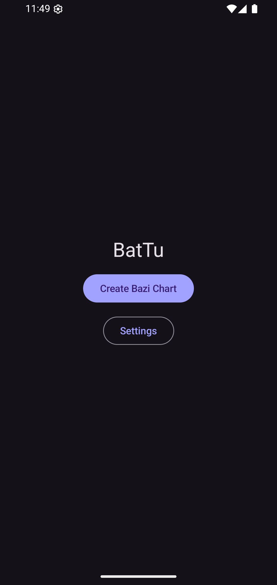
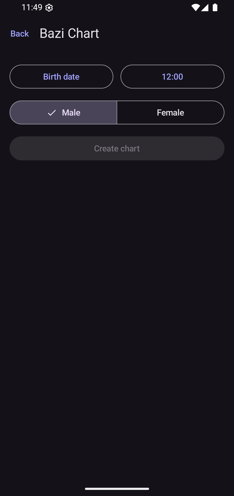
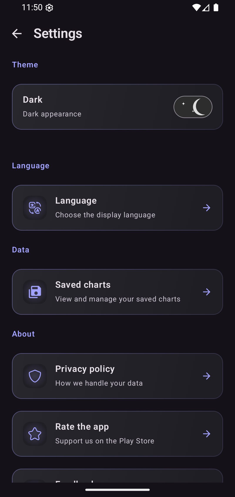
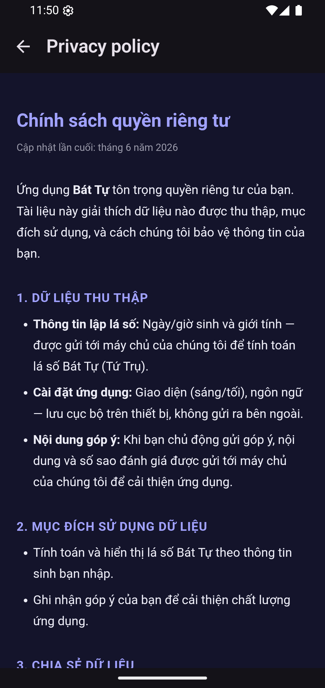

# BatTu — Bát Tự (Bazi) Chart App

> A modern Android app for casting and exploring **Bazi / Four Pillars of Destiny (Bát Tự)** charts, built with Jetpack Compose and Clean Architecture. Part of the **Anhnn ecosystem**.

[](https://kotlinlang.org)
[](https://developer.android.com/jetpack/compose)
[](#requirements)
[](#requirements)
[](#license)

---

## ✨ Features

- 🎴 **Bazi chart casting** — enter a solar birth date/time and gender to generate a full Four Pillars chart (Year / Month / Day / Hour), rendered in traditional pillar order with **Day Master** emphasis.
- 🌊 **Wuxing (Five Elements) analysis** — element power breakdown with signature element colors.
- 📜 **Geju (格局) pattern detection** — chart structure/pattern info when available from the backend.
- 💾 **Saved charts** — save, browse, and revisit previously cast charts.
- 🌐 **Bilingual UI (English / Tiếng Việt)** — in-app language switching with persisted locale, including Vietnamese display names for Chinese Bazi terminology.
- ⚙️ **Settings & Privacy Policy** — TuVi-style settings screen with an embedded privacy policy.
- 🤖 **AI chat-ready** — the raw chart payload is preserved verbatim so it can be streamed to the upcoming AI-chat endpoint.

## 📱 Screens

| Home | Chart Input | Settings | Privacy Policy |
|:---:|:---:|:---:|:---:|
|  |  |  |  |

| Screen | Description |
|---|---|
| **Home** | Entry point — create a chart or open settings |
| **Chart Input** | Birth date/time + gender input for chart casting |
| **Chart** | Full Bazi chart: four pillars, hidden stems, ten gods, Wuxing power, Geju |
| **Saved Charts** | List + detail view of locally saved charts |
| **Settings** | Theme, language switching, saved charts, privacy policy |

## 🏗 Architecture

The app follows **Clean Architecture** with strict layer separation and **unidirectional data flow** (single `StateFlow` UI state per ViewModel, events up as lambdas).

```
app/src/main/java/com/anhnn/battu/
├── core/            # Constants (backend base URL)
├── data/
│   ├── datasource/  # BaziApiService (Retrofit)
│   ├── models/      # DTOs + mappers
│   └── repository/  # Repository implementations (Dispatchers.IO, Result<T>)
├── domain/          # Pure Kotlin — no Android dependencies
│   ├── models/      # @Immutable entities (BaziChart, Gender, …)
│   ├── repository/  # Repository interfaces
│   └── usecases/    # Business logic
├── presentation/
│   ├── screens/     # home / chart / saved / settings
│   ├── viewmodels/  # StateFlow-based UI state
│   ├── navigation/  # Type-safe Compose Navigation (@Serializable routes)
│   ├── theme/       # Material 3 theme + Wuxing element colors
│   └── util/        # BaziVi — Vietnamese names for Bazi terms
└── di/              # Hilt modules (Network, Repository, App)
```

### Tech stack

| Area | Choice |
|---|---|
| Language | Kotlin 2.0 (JVM target 11) |
| UI | Jetpack Compose + Material 3 |
| DI | Hilt |
| Networking | Retrofit + kotlinx.serialization |
| Navigation | Type-safe Compose Navigation (`@Serializable` routes) |
| Localization | [`anhnn-language`](https://github.com/anhngocnguyen1034) (in-house JitPack library) |
| Build | Gradle (Groovy DSL) + version catalog (`gradle/libs.versions.toml`) |
| CI | Jenkins (`Jenkinsfile` → `.anhnn/build.sh`) with Discord notifications |

## 🔌 Backend

The app talks to the **FOR-BAZI** backend via a single endpoint:

```http
POST /api/v1/chart
Content-Type: application/json

{
  "datetime_str": "1995-08-17 10:30",
  "gender": "乾造 (Male)"   // or "坤造 (Female)" — exact strings required
}
```

> ⚠️ The backend URL in `core/Constants.kt` points to a local development server.
> Use `http://10.0.2.2:8000/` for the Android emulator, and replace it with your
> production URL before release builds.

The response's `chart` block is intentionally kept as raw JSON (`BaziChart.rawChartJson`) — it must be sent back unchanged as `chart_data` to the future `POST /api/v1/chat/stream` AI-chat endpoint.

## 🚀 Getting Started

### Requirements

- Android Studio (latest stable) with JDK 11+
- Android SDK 36
- A running FOR-BAZI backend instance (for chart data)

### Build & run

```bash
git clone <repo-url>
cd android-battu

./gradlew assembleDebug          # build debug APK
```

Or open the project in Android Studio and run the `app` configuration.

### Testing & lint

```bash
./gradlew testDebugUnitTest              # unit tests (offline — fake repositories + mocked JSON)
./gradlew connectedDebugAndroidTest      # Compose UI tests (device/emulator required)
./gradlew lint                           # Android lint
```

## 🧭 Development Conventions

Ecosystem-wide rules live in [`docs/`](docs/) — highlights:

- **Theming** — always use `MaterialTheme.colorScheme` tokens; no hardcoded hex in composables. Anhnn signature gradient: `#A1A2FF → #4B4EEE`.
- **Compose** — stateless composables via state hoisting, `@Immutable`/`@Stable` UI models, unique `key`s in lazy lists, at least two `@Preview`s (Light/Dark) per component.
- **Concurrency** — I/O on `Dispatchers.IO` inside repositories, never in ViewModels.
- **Error handling** — data layer returns `Result<T>`; `CancellationException` is always rethrown.
- **Testing** — fake repositories (no Mockito/MockK), `StandardTestDispatcher`, scenario-style test names (`should_show_error_when_static_service_fails`).

## 🌿 Branching & CI

| Branch | Purpose |
|---|---|
| `main` | Stable — PR target |
| `develop` | Active development — CI builds |
| `testing` | QA builds — CI builds |

Jenkins builds `develop`/`testing` and posts results to Discord.

## 📄 License

Proprietary — © Anhnn ecosystem. All rights reserved.

---

<p align="center">Made with ❤️ for the Vietnamese Bazi community</p>
